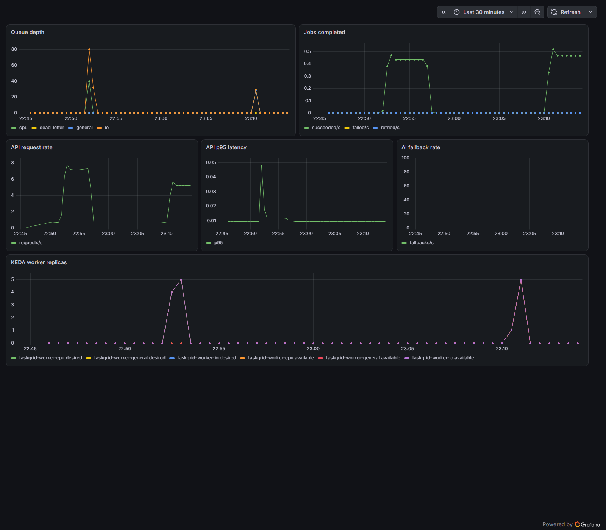

# TaskGrid

TaskGrid is a production-minded distributed job-processing platform written in
Go. It classifies workloads with Groq or deterministic rules, atomically queues
them in Redis, and uses KEDA to scale independent CPU, I/O, and general-purpose
worker pools on Kubernetes.

It is intentionally more than a queue demo: TaskGrid includes submission
idempotency, at-least-once delivery, worker heartbeats, abandoned-claim recovery,
bounded retries, a dead-letter queue, scoped API credentials, durable Redis
storage, operational metrics, alerts, a Grafana dashboard, and a reproducible
autoscaling benchmark.

## Architecture

~~~mermaid
flowchart LR
    Client --> API[Go API]
    API --> Groq
    API --> Redis[(Redis + AOF)]
    Redis --> CPU[CPU queue]
    Redis --> IO[I/O queue]
    Redis --> General[General queue]
    KEDA --> CPUWorkers[CPU workers]
    KEDA --> IOWorkers[I/O workers]
    KEDA --> GeneralWorkers[General workers]
    CPU --> CPUWorkers
    IO --> IOWorkers
    General --> GeneralWorkers
    CPUWorkers --> DLQ[Dead-letter queue]
    IOWorkers --> DLQ
    GeneralWorkers --> DLQ
    Prometheus --> API
    Prometheus --> Grafana
~~~

See [docs/architecture.md](docs/architecture.md) for the request lifecycle,
failure behavior, and delivery guarantees.

## Engineering highlights

- Atomic Redis Lua transitions for create, enqueue, retry, completion, recovery,
  acknowledgement, and dead-letter operations.
- Idempotency-Key support prevents duplicate work when clients retry a request.
- At-least-once worker claims with heartbeats and abandoned-job recovery.
- Configurable retry budget, timeout, output limit, retention, and executable
  allowlist.
- Hybrid AI scheduler with validated Groq output and deterministic fallback.
- Rules-only mode for repeatable tests without AI API calls or charges.
- Independent KEDA scale-to-zero worker pools.
- Admin, submit-only, and read-only bearer credentials.
- Redis-backed per-credential rate limiting.
- Liveness, dependency readiness, structured audit logs, Prometheus metrics,
  alert rules, and a Grafana dashboard.
- Non-root, read-only containers with dropped capabilities and Kubernetes
  seccomp configuration.
- Redis AOF persistence backed by a Docker volume or Kubernetes PVC.
- CI format, vet, race, coverage, build, Compose validation, and container steps.

## Quick start with Docker Compose

Requirements: Docker Desktop with Docker Compose.

1. Create an ignored .env file:

~~~dotenv
GROQ_API_KEY=your-existing-groq-key
GROQ_MODEL=openai/gpt-oss-20b
TASKGRID_API_TOKEN=choose-a-long-random-token
TASKGRID_SCHEDULER_MODE=hybrid
~~~

Do not commit or paste any secret. To run without Groq, omit GROQ_API_KEY and set
TASKGRID_SCHEDULER_MODE=rules.

2. Start Redis, the API, and all three worker pools:

~~~powershell
docker compose up --build
~~~

3. Submit an idempotent job:

~~~powershell
$headers = @{
    Authorization = "Bearer $env:TASKGRID_API_TOKEN"
    "Idempotency-Key" = "demo-001"
}
$body = @{
    name = "verification"
    description = "lightweight notification"
    command = "echo taskgrid-ok"
} | ConvertTo-Json
Invoke-RestMethod -Method Post -Uri http://localhost:8080/jobs -Headers $headers -ContentType application/json -Body $body
~~~

Repeating the request with the same Idempotency-Key returns the original job and
sets Idempotent-Replayed: true instead of creating duplicate work.

## API

| Method | Path | Admin | Submit | Read | Purpose |
| --- | --- | --- | --- | --- | --- |
| GET | /health | Public | Public | Public | Process liveness |
| GET | /readyz | Public | Public | Public | Redis dependency readiness |
| GET | /metrics | Public | Public | Public | Prometheus metrics |
| POST | /schedule | Yes | Yes | No | Return a scheduling decision |
| POST | /jobs | Yes | Yes | No | Create and enqueue a job |
| GET | /jobs?limit=50&offset=0 | Yes | No | Yes | Paginated recent jobs |
| GET | /jobs/{id} | Yes | No | Yes | Read one job |

TASKGRID_API_TOKEN remains backward-compatible as an admin token. Production
deployments should use distinct TASKGRID_ADMIN_TOKEN, TASKGRID_SUBMIT_TOKEN, and
TASKGRID_READ_TOKEN values.

## Kubernetes and KEDA

Requirements: Docker Desktop, kubectl, kind, and Helm.

~~~powershell
docker build -t taskgrid:latest .
kind create cluster --name taskgrid
kind load docker-image taskgrid:latest --name taskgrid
helm repo add kedacore https://kedacore.github.io/charts
helm repo update
helm upgrade --install keda kedacore/keda --namespace keda --create-namespace
~~~

Create the secret locally. Existing legacy TASKGRID_API_TOKEN values remain
supported:

~~~powershell
kubectl create secret generic taskgrid-ai --from-literal=GROQ_API_KEY="your-existing-key" --from-literal=TASKGRID_API_TOKEN="your-existing-token"
kubectl apply -k k8s
kubectl rollout status deployment/taskgrid-api
kubectl port-forward service/taskgrid-api 8080:8080
~~~

The Kustomize entry point contains only the supported API, Redis, and three
KEDA-managed worker-pool resources.

The optional production Redis NetworkPolicy is applied separately:

~~~powershell
kubectl apply -f k8s/production/redis-networkpolicy.yaml
~~~

## Monitoring

The optional k8s/monitoring resources integrate with kube-prometheus-stack:

- ServiceMonitor for API metrics
- availability, backlog, dead-letter, and error-rate alerts
- TaskGrid Operations Grafana dashboard

Installation commands are in
[k8s/monitoring/README.md](k8s/monitoring/README.md).

## Reproducible scaling benchmark

Use rules mode for benchmarks so the run makes no Groq calls:

~~~powershell
$env:TASKGRID_API_TOKEN = "your-existing-local-token"
.\scripts\autoscaling-demo.ps1 -Jobs 120 -Concurrency 20
~~~

The script temporarily switches the Kubernetes API deployment to deterministic
scheduling, submits a balanced workload, displays worker replica changes, emits
p50/p95/p99 submission latency and completion counts, and restores hybrid
scheduling. See [docs/benchmark.md](docs/benchmark.md).

### Verified local result

A 120-job run on the `kind-taskgrid` cluster completed 120/120 jobs in 29.18
seconds, with 45.182 ms p95 submission latency. KEDA independently scaled the
CPU, I/O, and general pools from zero to five replicas each, then returned every
pool to zero in 25.25 seconds. This is local benchmark evidence, not a production
SLA; the full methodology and percentiles are in
[docs/benchmark.md](docs/benchmark.md).

## Configuration

| Variable | Default | Purpose |
| --- | --- | --- |
| REDIS_ADDR | localhost:6379 | Redis endpoint |
| TASKGRID_MODE | all | api, worker, or all |
| WORKER_TYPE | general | cpu, io, or general |
| GROQ_API_KEY | empty | Groq credential; never required in rules mode |
| GROQ_MODEL | openai/gpt-oss-20b | Groq model |
| TASKGRID_SCHEDULER_MODE | hybrid | hybrid, ai, or rules |
| TASKGRID_API_TOKEN | empty | Legacy admin credential |
| TASKGRID_ADMIN_TOKEN | empty | Full-access credential |
| TASKGRID_SUBMIT_TOKEN | empty | Job-submission credential |
| TASKGRID_READ_TOKEN | empty | Job-read credential |
| TASKGRID_REQUIRE_AUTH | false | Refuse API startup when no token exists |
| TASKGRID_ALLOW_SHELL_COMMANDS | false | Opt into shell evaluation |
| TASKGRID_ALLOWED_COMMANDS | empty | Comma-separated direct-execution allowlist |
| TASKGRID_MAX_ATTEMPTS | 3 | Total execution attempts |
| TASKGRID_JOB_TIMEOUT_SECONDS | 30 | Per-attempt execution deadline |
| TASKGRID_MAX_OUTPUT_BYTES | 65536 | Captured stdout/stderr limit |
| TASKGRID_JOB_RETENTION_HOURS | 168 | Job and idempotency retention |
| TASKGRID_RATE_LIMIT_PER_MINUTE | 0 | Per-credential request budget; 0 disables it |

## Development

~~~powershell
gofmt -w .
go vet ./...
go test -race ./...
go build ./...
~~~

Dependabot monitors Go modules, container images, and GitHub Actions.

## Production scope

TaskGrid now demonstrates production engineering patterns, but a local kind
cluster is not itself a production service. A public deployment still requires
a chosen cloud provider, immutable image registry, TLS ingress, managed secret
storage, managed Redis or tested backups, external identity for untrusted users,
and a real load-test report from that environment. These are deployment and
account decisions, not claims this repository fakes.

See [docs/security.md](docs/security.md) and
[docs/operations.md](docs/operations.md) before exposing TaskGrid beyond a
trusted environment.
